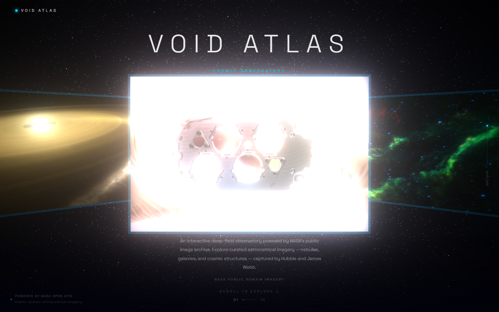
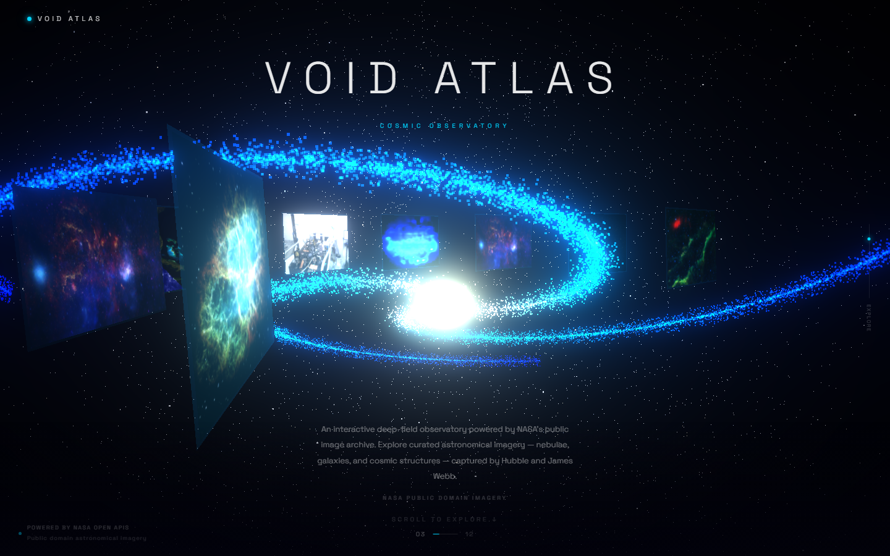
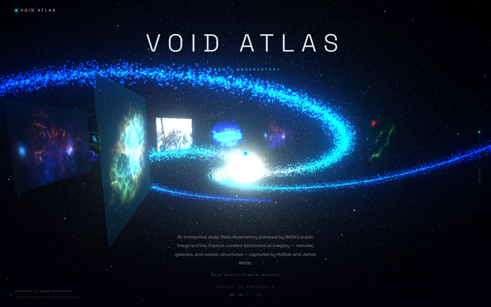

# Void Atlas

A 3D interactive cosmic observatory built for the browser. You scroll through
deep space while a galaxy of NASA imagery rotates around you.


---

## What it does

I wanted to build something that felt less like a website and more like an
actual place you visit. Void Atlas pulls images from NASA's public APIs and
displays them as floating panels orbiting a spiral galaxy particle system in
Three.js. As you scroll, the galaxy rotates and each image comes into focus
one at a time. Click any image to see its metadata and jump to the original
NASA source page.

The whole thing runs in the browser — no backend, no login, just space.

---

## Screenshots

**Landing view**



**Image in focus**



**Node detail modal**



---

## Tech stack

- **Three.js** — 3D scene, particle systems, geometry, WebGL renderer
- **React 18 + Vite** — UI shell and build tooling
- **GSAP** — scroll-driven camera and animation system
- **NASA APOD API** — Astronomy Picture of the Day
- **NASA Image Library API** — searchable archive of space imagery
- **Space Grotesk** — typography

No UI component libraries. No React Three Fiber. Raw Three.js for full control
over the render pipeline.

---

## How it works

The scene has a few main parts:

**Galaxy core** — 18,000 particles arranged into a three-armed spiral using
parametric math. The core is warm gold, the arms fade to electric blue. It
rotates slowly and pulses.

**Orbit ring** — NASA images load as textured planes positioned in a circle
around the galaxy. As you scroll, the ring rotates so each image cycles
through the front-facing position. The focused image scales up slightly.

**Scroll system** — A normalized 0→1 progress value drives everything.
ScrollController converts raw browser scroll events into that progress value.
GSAP animates the ring rotation and camera based on it.

**Data pipeline** — On load, the app attempts to fetch from NASA APOD and the
NASA Image Library. If the API is unavailable or rate-limited, it falls back
to a curated local archive of 24 high-resolution space images. Either way,
12 randomly selected images load into the scene.

**Post-processing** — EffectComposer with UnrealBloomPass makes the galaxy
core and particle helix glow. A vignette shader darkens the screen edges for
a cinematic frame.

---

## Running locally

```bash
git clone https://github.com/YOUR_USERNAME/void-atlas
cd void-atlas
npm install
```

Get a free NASA API key at [api.nasa.gov](https://api.nasa.gov/) — takes
about 30 seconds. Then:

```bash
cp .env.example .env
# Add your key to .env
npm run dev
```

Open `http://localhost:5173`. Without a NASA API key the app still works —
it uses `DEMO_KEY` which has a lower rate limit, and falls back to the local
image archive if needed.

---

## Deploying

This deploys to Vercel in about 2 minutes:

```bash
npm install -g vercel
vercel
```

Follow the prompts. When asked about build settings:
- **Build command:** `npm run build`
- **Output directory:** `dist`
- **Framework:** Vite

Add your `VITE_NASA_API_KEY` in Vercel's dashboard under
Settings → Environment Variables.

The public URL Vercel gives you is what to submit — not the
`vercel.com/<you>/<project>` dashboard link.

---

## Project structure